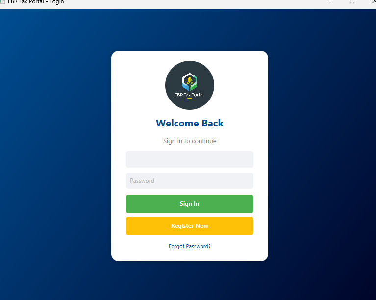
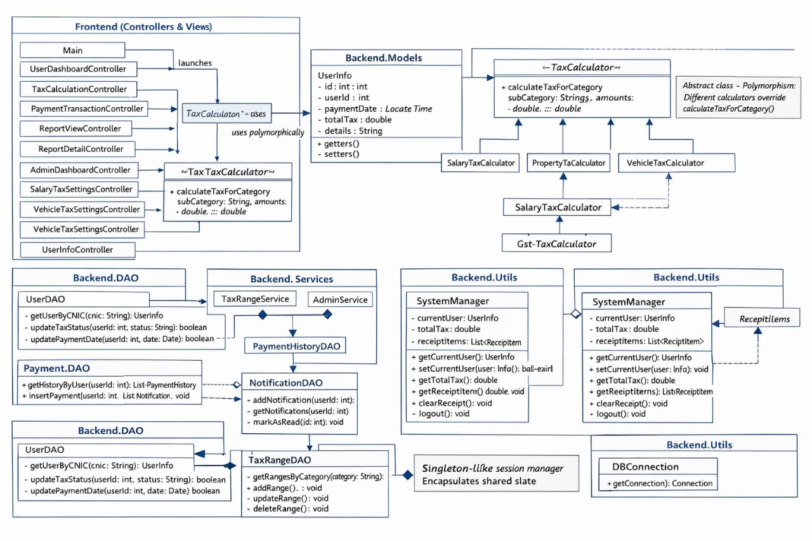

<h1>FBR-TAX-PORTAL</h1>

<h2>Project Overview</h2>

<strong>FBR-TAX-PORTAL</strong> is a desktop-based <strong>Taxpayer Management System</strong>
developed as an <strong>Object-Oriented Programming (OOP) Java project</strong>.

The system simulates a user-friendly tax portal where taxpayers can register,
calculate taxes, make payments, and manage tax records, while administrators
can manage tax rates, users, and notifications.

<h3>OOP Principles Used</h3>
<ul>
  <li>Encapsulation</li>
  <li>Inheritance</li>
  <li>Polymorphism</li>
  <li>Frontend & Backend Separation</li>
</ul>

The project uses <strong>JavaFX</strong> for a modern graphical user interface and
<strong>MySQL</strong> for secure data storage and management.

<h2>How to Run the Project</h2>
<ol>
  <li>Install <strong>JDK 25</strong></li>
  <li>Install <strong>MySQL Server</strong> and <strong>MySQL Workbench</strong></li>
  <li>Add <strong>MySQL Connector/J (JAR file)</strong> to the project classpath</li>
  <li>Update database credentials in <code>DBconnection.java</code></li>
  <li>Open the project in <strong>VS Code</strong></li>
  <li>Run the <strong>Main</strong> class</li>
</ol>

<h2>How the System Works</h2>

When the program is executed, a splash screen appears for 5 seconds, after which
the main workflow starts.

<h3>Login & Registration</h3>

When the application starts, the Login Interface appears.

<h3>Registration</h3>

If the user is new, they click <strong>Register Now</strong>.

There are two types of registration:

<ul>
  <li>User Registration</li>
  <li>Admin Registration</li>
</ul>

All credentials (CNIC, password, and role) are securely stored in the MySQL database.

<h2>Admin Module</h2>

After admin login, the Admin Dashboard is displayed.

<h3>Admin Features</h3>
<ul>
  <li>View and manage user data</li>
  <li>Send tax reminders if deadlines are missed</li>
  <li>Update penalties</li>
  <li>Manage tax rates</li>
  <li>Update tax payment status (Paid / Unpaid)</li>
  <li>Logout securely</li>
</ul>

<h3>Tax Rates Management (Admin)</h3>

When the Tax Rates button is clicked, the tax management menu appears.

Admin can:

<ul>
  <li>Add tax rates</li>
  <li>Update tax ranges and categories</li>
  <li>Delete tax records</li>
  <li>Modify tax rules</li>
</ul>

<h3>Tax Status Toggle</h3>

<h2>User Dashboard</h2>

After user login, the User Dashboard appears.

<h3>User Dashboard Features</h3>

<h4>1- User Info</h4>

View and update personal information.

<h4>2- Tax Rates (Read-Only)</h4>

View tax ranges and categories managed by admin.

<h4>3- Tax Calculation</h4>

Select tax type, enter income/value, and the system calculates tax automatically
and sends it to the payment module.

<h4>4- Payment & Transactions</h4>

View payable tax amount and click Pay Now to complete payment.

<h4>5- History & Records</h4>

View complete history of paid taxes.

<h4>6- Alerts & Notifications</h4>

Receive tax reminders and admin notifications.

<h4>7- Report Ready Data</h4>

Select paid tax, generate documented tax slip, save as PDF, and print report.

<h4>8- Logout</h4>

User can securely log out of the system.

<h2>UML Diagram</h2>

The UML Class Diagram represents:

<ul>
  <li>User and Admin classes</li>
  <li>DAO classes</li>
  <li>Database connection</li>
  <li>Tax, Payment, and Notification modules</li>
</ul>

<h2>Future Improvements</h2>
<ul>
  <li>Online payment gateway integration</li>
  <li>Enhanced security and encryption</li>
  <li>Cloud-based database support</li>
  <li>Advanced reporting and analytics</li>
  <li>Mobile application version</li>
</ul>
